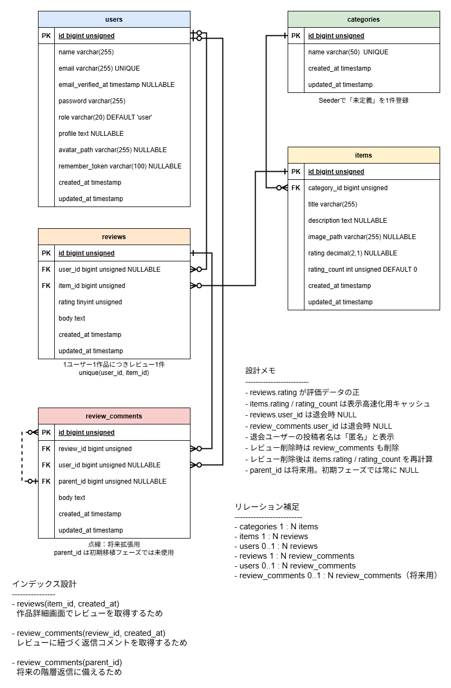

# 映画レビューアプリ Laravel移植版

## 概要

PHPスクラッチMVCで作成した映画レビューアプリをLaravel 10へ移植する。
まずはスクラッチ版の最低限機能をLaravelへ移植し、その後、必要に応じて管理者機能やTMDB API連携などを追加します。

## 目的

- LaravelのMVC構造を学習する
- スクラッチMVCで実装した機能をLaravel流に置き換える
- DB設計、認証、バリデーション、ルーティングを整理する
- ポートフォリオとして、設計・実装・運用方針を説明できる状態にする

## 使用技術

- PHP 8.2
- Laravel 10
- Laravel Sail
- MySQL
- phpMyAdmin
- Mailpit（ローカルのメール確認用）
- Laravel Breeze
- Blade
- Tailwind CSS
- Vite
- PHPUnit
- PHPStan / Larastan
- Laravel Pint
- Laravel IDE Helper
- Git / GitHub

## CI

GitHub Actionsを使用し、Pull Requestおよび`main` / `develop`ブランチへのpush時に、次の品質チェックを自動実行します。

- Laravel Pint
- PHPStan / Larastan Level 4
- Vite build
- PHPUnit（MySQL環境）

Composer依存関係は`composer.lock`、npm依存関係は`package-lock.json`を正本として、固定されたバージョンを使用します。

## 開発環境

### ローカル環境のポート設定

このプロジェクトでは、ローカル環境のポート競合を避けるため、Laravel Sailのポート番号を以下のように設定しています。

| 用途 | URL / ポート |
|---|---|
| Laravel | http://localhost:82 |
| MySQL外部接続 | localhost:3308 |
| phpMyAdmin | http://localhost:8083 |
| Mailpit SMTP | localhost:1025 |
| Mailpit Web UI | http://localhost:8025 |

## 主な機能

### 初期移植フェーズ

#### 共通機能

- 作品一覧表示
- 作品一覧ページネーション
- 作品詳細表示
- レビュー表示
- レビュー返信表示
- 星評価表示

#### ゲスト機能

- 会員登録
- ログイン
- パスワードリセット

#### 会員機能

- ログアウト
- アカウント管理
- ユーザーアイコンの登録・差し替え・表示
- 会員退会
- レビュー・評価投稿 / 削除（1ユーザーにつき1作品1件）
- レビュー返信投稿
- 本人のレビュー一覧表示
- レビュー履歴ページネーション

### 後続フェーズで検討する機能

#### 共通機能

- お問い合わせフォーム

#### 会員機能

- レビュー編集
- レビュー返信編集
- レビュー返信削除
- お気に入り機能

#### 管理者機能

- 作品一覧表示（ページネーション・平均評価表示）
- 作品詳細（モーダル表示）
- 作品登録（画像アップロード）
- 作品編集（既存画像差し替え対応）
- 作品削除（確認モーダル付き）
- お問い合わせ管理

#### 外部API連携

- TMDB API連携

## DB設計

初期移植フェーズでは、既存スクラッチ版のDB構成を参考にしつつ、Laravelのマイグレーション、Eloquentリレーション、Laravel Breezeの認証機能に合わせて再設計しています。

レビュー本文と評価は `reviews` テーブルで一体管理し、作品一覧・作品詳細で表示する平均評価と評価件数は `items` テーブルにキャッシュとして保持します。

また、会員退会時は `users` レコードを物理削除し、投稿済みレビューやレビュー返信コメントは投稿者情報を切り離して匿名表示する方針です。

詳細なテーブル定義、リレーション、削除時の方針は、[DB設計](docs/DATABASE.md) に整理しています。

## ドキュメント

- [GitHub開発運用ガイド](docs/GITHUB_WORKFLOW.md)
- [開発フロー](docs/DEVELOPMENT_FLOW.md)
- [実装計画](docs/IMPLEMENTATION_PLAN.md)
- [MVP1テスト対応状況](docs/MVP1_TEST_COVERAGE.md)
- [Claude Code実装前検証運用手順](docs/CLAUDE_CODE_PRE_IMPLEMENTATION_REVIEW.md)
- [Claude Codeレビュー運用手順](docs/CLAUDE_CODE_REVIEW.md)
- [Claude Code権限設計](docs/CLAUDE_CODE_PERMISSION_DESIGN.md)
- [要件定義](docs/REQUIREMENTS.md)
- [機能一覧](docs/FEATURES.md)
- [画面遷移](docs/SCREEN_TRANSITIONS.md)
- [DB設計](docs/DATABASE.md)
- [ルーティング設計](docs/ROUTES.md)
- [セキュリティ方針](docs/SECURITY.md)
- [コマンド集](docs/COMMANDS.md)
- [トラブルシューティング](docs/TROUBLESHOOTING.md)
- [デプロイ方針](docs/DEPLOYMENT.md)

## 開発方針

- 作業ブランチを作成する前にIssueを作成する
- 最新の`develop`から作業ブランチを作成する
- 通常のPull Requestは作業ブランチから`develop`へ作成する
- 公開可能な単位を`develop`から`main`への同期Pull Requestで反映する
- 通常の作業コミットを`main`または`develop`へ直接pushせず、force pushを使用しない
- コミットは1目的1コミットを基本とする
- Issue、ブランチ、Pull Request、マージ、マージ後整理の詳細は[GitHub開発運用ガイド](docs/GITHUB_WORKFLOW.md)を参照する
- まずはスクラッチ版の最低限機能をLaravelへ移植する
- 管理者機能や外部API連携は後続フェーズで検討する
- セキュリティと正常動作のバランスを重視する
