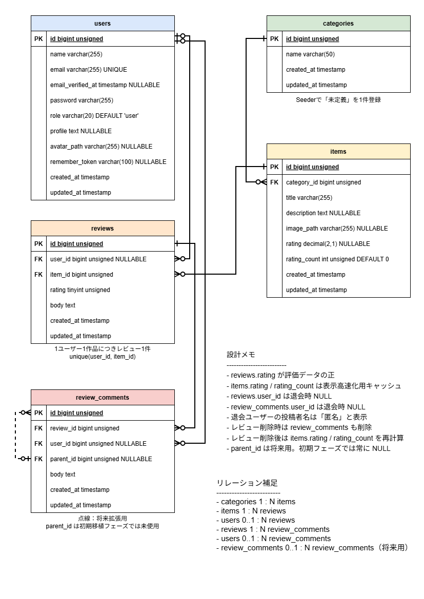

# DB設計

## このドキュメントの目的

このドキュメントでは、映画レビューアプリ Laravel移植版のDB設計を整理する。

既存スクラッチ版のDB構成をベースにしつつ、Laravelのマイグレーション、Eloquentリレーション、認証機能に合わせて再設計する。

初期移植フェーズでは、ユーザー機能の最低限移植に必要なテーブルを中心に整理する。

管理者機能やTMDB API連携の画面実装は後続フェーズで検討する。

ただし、DB設計は後から大きく変更すると影響範囲が広いため、カテゴリ、権限、評価キャッシュなど、将来拡張を見越した設計を初期段階で整理する。

## ER図

初期移植フェーズのDB設計をもとに、ER図を作成しています。



編集用ファイル:

- [database-er.drawio](./diagrams/database-er.drawio)

## DB設計方針

- Laravelのマイグレーションでテーブルを管理する
- Laravel Breezeの `users` テーブルをベースに認証機能を構成する
- 既存スクラッチ版のDB構成を参考にする
- レビュー本文と評価は `reviews` テーブルで一体管理し、ユーザーと作品に紐づける
- レビューへの返信コメントは `review_comments` テーブルで管理する
- 評価平均と評価件数は `items` テーブルにキャッシュとして保持する
- 外部キー制約を適切に設定する
- 初期移植フェーズでは物理削除を基本とし、退会ユーザーの投稿は投稿者情報を切り離して匿名表示する
- 論理削除は、後続フェーズで必要になった場合に検討する
- 既存データをそのまま使うか、Seederで移行するかは後続で検討する

## 初期移植フェーズで使用する主なテーブル

| テーブル | 概要 |
|---|---|
| `users` | 会員情報を管理する |
| `categories` | 作品カテゴリを管理する |
| `items` | 映画作品情報を管理する |
| `reviews` | 作品レビューを管理する |
| `review_comments` | レビューへの返信コメントを管理する |

## users テーブル

Laravel Breezeの認証機能をベースに使用する。

| カラム | 型 | 制約・補足 |
|---|---|---|
| `id` | bigint unsigned | 主キー |
| `name` | varchar(255) | ユーザー名 |
| `email` | varchar(255) | 一意 |
| `email_verified_at` | timestamp nullable | メール認証を使用する場合に利用 |
| `password` | varchar(255) | ハッシュ化したパスワード |
| `role` | varchar(20) | 権限。初期値は `user` |
| `profile` | text nullable | 自己紹介文 |
| `avatar_path` | varchar(255) nullable | プロフィール画像パス |
| `remember_token` | varchar(100) nullable | ログイン保持用 |
| `created_at` | timestamp | 作成日時 |
| `updated_at` | timestamp | 更新日時 |

### 補足

初期移植フェーズでは、Breeze標準の `users` テーブルをベースにする。

プロフィール編集機能に対応するため、`profile` と `avatar_path` を追加する。

将来の管理者機能に備えて、`role` を初期設計に含める。

## categories テーブル

作品カテゴリを管理する。

| カラム | 型 | 制約・補足 |
|---|---|---|
| `id` | bigint unsigned | 主キー |
| `name` | varchar(50) | カテゴリ名 |
| `created_at` | timestamp | 作成日時 |
| `updated_at` | timestamp | 更新日時 |

### 補足

初期移植フェーズでは、カテゴリ検索やカテゴリ管理画面は実装しない。

ただし、`items.category_id` を必須の外部キーとして扱うため、`categories` テーブルは初期設計に含める。

初期データとして、Seederで `未定義` カテゴリを1件登録する。

MVPでは、登録済み作品の `category_id` は原則として `未定義` カテゴリを参照する。

カテゴリ機能を拡張する場合は、後続フェーズでカテゴリ追加・編集・検索・絞り込みを検討する。

## items テーブル

映画作品情報を管理する。

| カラム | 型 | 制約・補足 |
|---|---|---|
| `id` | bigint unsigned | 主キー |
| `category_id` | bigint unsigned | `categories.id` への外部キー |
| `title` | varchar(255) | 作品タイトル |
| `description` | text nullable | 作品説明 |
| `image_path` | varchar(255) nullable | 作品画像パス |
| `rating` | decimal(2,1) nullable | 平均評価キャッシュ |
| `rating_count` | int unsigned | 評価件数キャッシュ。初期値は 0 |
| `created_at` | timestamp | 作成日時 |
| `updated_at` | timestamp | 更新日時 |

### 補足

`items.category_id` は `categories.id` に紐づける。

初期移植フェーズでは、カテゴリ検索やカテゴリ管理画面は作成しない。

MVPでは、Seederで登録する `未定義` カテゴリを作品のカテゴリとして使用する。

### 評価キャッシュ方針

`items.rating` と `items.rating_count` は、`reviews.rating` の集計結果をキャッシュする。

作品一覧や作品詳細で毎回集計するとDB負荷が増えるため、評価投稿・更新時にキャッシュを更新する方針とする。

初期移植フェーズでは、以下の方針とする。

- `reviews.rating` を評価データの正とする
- `items.rating` には平均評価を保持する
- `items.rating_count` には評価件数を保持する
- `items.rating` / `items.rating_count` は表示高速化用のキャッシュとして扱う
- レビュー投稿・削除時は、対象作品の平均評価と評価件数を再計算する
- キャッシュ更新処理はトランザクション内で行う

## reviews テーブル

作品レビューを管理する。

レビュー本文と評価は一体の投稿として扱う。

| カラム | 型 | 制約・補足 |
|---|---|---|
| `id` | bigint unsigned | 主キー |
| `user_id` | bigint unsigned nullable | `users.id` への外部キー。退会により投稿者ユーザーが存在しない場合は `null` とし、画面上では投稿者名を「匿名」と表示する |
| `item_id` | bigint unsigned | `items.id` への外部キー |
| `rating` | tinyint unsigned | 評価。1〜5 |
| `body` | text | レビュー本文 |
| `created_at` | timestamp | 作成日時 |
| `updated_at` | timestamp | 更新日時 |

### 制約

- 1ユーザーが1作品に投稿できるレビューは1件までとする
- `user_id` と `item_id` の組み合わせにユニーク制約を設定する
- `rating` は1〜5の範囲とする

```text
unique(user_id, item_id)
```

`user_id` は会員退会時に `null` になり得る。
MySQLではユニーク制約に含まれる `null` は複数許容されるが、退会済みユーザーのレビューは重複投稿制御の対象外とする。

## review_comments テーブル

レビューへの返信コメントを管理する。

| カラム | 型 | 制約・補足 |
|---|---|---|
| `id` | bigint unsigned | 主キー |
| `review_id` | bigint unsigned | `reviews.id` への外部キー |
| `user_id` | bigint unsigned nullable | `users.id` への外部キー。退会により投稿者ユーザーが存在しない場合は `null` とし、画面上では投稿者名を「匿名」と表示する |
| `parent_id` | bigint unsigned nullable | `review_comments.id` への外部キー。将来の返信への返信用。初期移植フェーズでは使用しない |
| `body` | text | 返信本文 |
| `created_at` | timestamp | 作成日時 |
| `updated_at` | timestamp | 更新日時 |

### 補足

レビューへの返信は `review_comments` テーブルで管理する。

初期移植フェーズでは、レビューに対する1階層コメントのみ対応する。

返信コメントへの返信は、初期移植フェーズでは実装しない。

ただし、将来的な多階層返信に備えて、`parent_id` を用意する。

初期移植フェーズでは `parent_id` は使用せず、常に `null` とする。

会員退会時は `users` レコードを物理削除するが、投稿済みのレビューコメント本文は削除しない。

退会により投稿者ユーザーが存在しないレビューコメントは、画面上では投稿者名を「匿名」と表示する。

編集・削除は後続フェーズで検討する。

## リレーション設計

### User

| リレーション | 内容 |
|---|---|
| `reviews()` | ユーザーは複数のレビューを持つ |
| `reviewComments()` | ユーザーは複数のレビューコメントを持つ |

### Category

| リレーション | 内容 |
|---|---|
| `items()` | カテゴリは複数の作品を持つ |

### Item

| リレーション | 内容 |
|---|---|
| `category()` | 作品は1つのカテゴリに属する |
| `reviews()` | 作品は複数のレビューを持つ |

### Review

| リレーション | 内容 |
|---|---|
| `user()` | レビューは1人のユーザーに属する。退会により投稿者ユーザーが存在しない場合は `null` になり得る |
| `item()` | レビューは1つの作品に属する |
| `comments()` | レビューは複数のレビューコメントを持つ |

### ReviewComment

| リレーション | 内容 |
|---|---|
| `user()` | レビューコメントは1人のユーザーに属する。退会により投稿者ユーザーが存在しない場合は `null` になり得る |
| `review()` | レビューコメントは1つのレビューに属する |
| `parent()` | レビューコメントは親コメントを持つ場合がある。初期移植フェーズでは使用しない |
| `children()` | レビューコメントは複数の子コメントを持つ場合がある。初期移植フェーズでは使用しない |

## 削除時の方針

### レビュー削除時

会員は、自分が投稿したレビューのみ削除できる。

レビュー本文と評価は `reviews` テーブルで一体管理するため、レビュー削除時は本文と評価の両方を削除する。

レビューが削除された場合、そのレビューに紐づく `review_comments` も削除する。

レビュー削除後は、対象作品の平均評価と評価件数を再計算し、`items.rating` と `items.rating_count` を更新する。

### 会員退会時

会員退会時は、`users` レコードを物理削除する。

ただし、退会ユーザーが投稿したレビュー本文およびレビューコメント本文は削除せず、表示履歴として残す。

そのため、`reviews.user_id` および `review_comments.user_id` は、投稿者ユーザーが存在しない場合に `null` になり得る。

投稿者ユーザーが存在しないレビュー・レビューコメントは、画面上では投稿者名を「匿名」と表示する。

退会後のレビュー・レビューコメントは、投稿者との紐づきがなくなるため編集不可とする。

退会ユーザーのお気に入りデータは、将来お気に入り機能を追加した場合も削除する方針とする。

### 作品削除時

管理者機能は後続フェーズで検討する。

後続フェーズで作品削除機能を実装する場合、作品が削除されたときは、その作品に紐づくレビューも削除する。

レビューが削除されるため、そのレビューに紐づく `review_comments` も削除する。

作品削除は影響範囲が大きいため、実装時は確認画面または確認モーダルで、関連するレビュー・レビューコメントも削除されることを明示する。

## 将来拡張として設計時に考慮する項目

以下は初期移植フェーズでは画面実装しないが、DB設計時点で拡張しやすいように考慮する。

### 管理者機能

- `users.role` は初期設計に含める
- 管理者用middlewareは後続フェーズで実装する
- 作品登録・編集・削除画面は後続フェーズで実装する
- 操作ログは後続フェーズで検討する

### TMDB API連携

TMDB API連携は後続フェーズで実装する。

ただし、将来的に以下のカラム追加を検討する。

| カラム | 概要 |
|---|---|
| `tmdb_id` | TMDB上の作品ID |
| `poster_path` | TMDBのポスター画像パス |
| `release_date` | 公開日 |
| `original_title` | 原題 |
| `overview` | TMDBから取得した概要 |

### アクセス数・集計機能

管理者機能でアクセス数や利用状況を確認する場合、以下を検討する。

- 作品ごとのアクセス数
- 作品詳細表示回数
- レビュー投稿数
- 星評価投稿数
- 日別集計テーブル

### お気に入り機能

お気に入り機能は後続フェーズで実装する。

追加する場合は、`favorites` テーブルを作成し、`users` と `items` の多対多関係として管理する。

想定カラム:

| カラム | 概要 |
|---|---|
| `id` | 主キー |
| `user_id` | お気に入りしたユーザーID |
| `item_id` | お気に入りされた作品ID |
| `created_at` | 作成日時 |
| `updated_at` | 更新日時 |

同一ユーザーが同一作品を重複してお気に入り登録できないように、`user_id` と `item_id` の組み合わせを一意にする。

会員退会時は、退会ユーザーのお気に入りデータを削除する方針とする。

### 問い合わせフォーム機能

問い合わせフォーム機能は後続フェーズで検討する。

追加する場合は、`contacts` テーブルを作成し、問い合わせ内容を管理する。

ログインユーザーからの問い合わせは `user_id` に紐づけ、ゲストからの問い合わせは `user_id` を `null` とする方針を検討する。

想定カラム:

| カラム | 概要 |
|---|---|
| `id` | 主キー |
| `user_id` | 問い合わせしたユーザーID。ゲストの場合は `null` |
| `name` | 問い合わせ者名 |
| `email` | 返信先メールアドレス |
| `subject` | 件名 |
| `body` | 問い合わせ本文 |
| `status` | 対応状況 |
| `created_at` | 作成日時 |
| `updated_at` | 更新日時 |

`status` では、未対応・確認済み・返信済み・対応完了などの状態管理を想定する。

## 補足

このドキュメントでは、DB設計とリレーション方針を整理する。

具体的なマイグレーションファイルは、実装フェーズで作成する。

ルーティング設計は docs/ROUTES.md に整理する。

認証・認可の詳細は docs/SECURITY.md に整理する。
